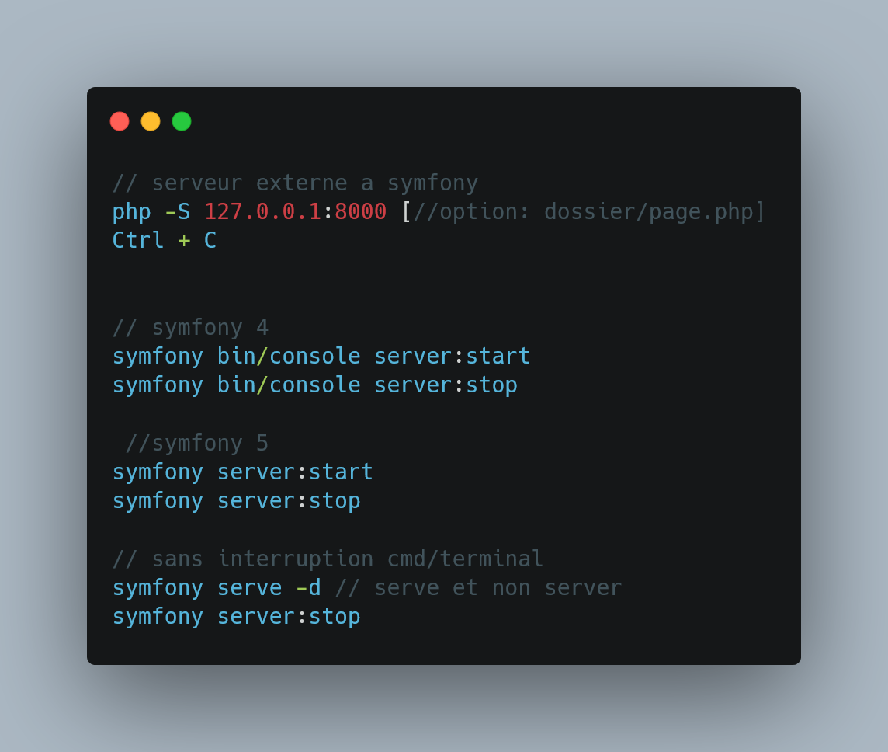
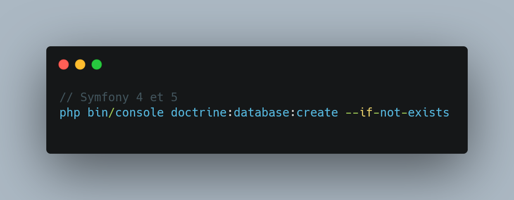

### Rappel de Symfony 5

#### Thermes

_____

#### Commande courrantes

##### commande  serveur



_____

##### Crée sa base de donnée 



Cette doctrine vas se basée sur votre dsn (data source name) c'est à dire le fichier qui permet de vous connecter à votre base de donnée, la variable d'environnement de votre application. Le sufixe ```--i-not-exists``` est optionnelle, il check si la base existe ou non.

_____

##### Crée une entitée

#####  

L'Entitée deviendras votre table cotée sql. Cotée application cela créeras une entitée avec différentes fonctions (getter et setter) et annotations propre à d'environnement Symfony, dans ces annotations nous y retrouvont également le type souhaitée, la longueur max demandée et valeur nullable, si une valeur est à not null alors ce champs doit être obligatoirement remplit.

Par convention les entitée sont en Camel Case. L'id est automatiquement générée si celui ci n'est pas déclarée.: 


 

#### Liens utiles

_____

